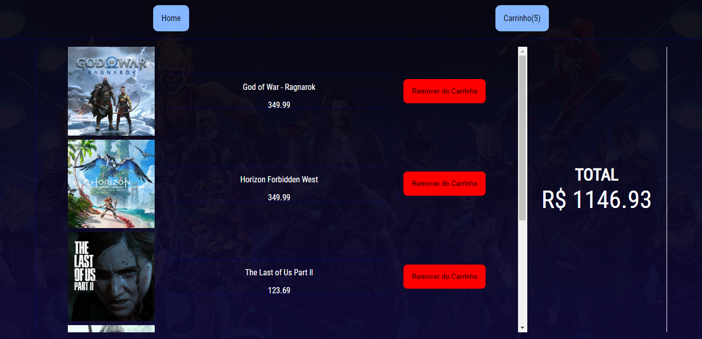

# Context E-Commerce

Projeto criado para entender mais sobre o useContext e suas funcionalidades em uma aplicação React.

## Stack utilizada

**Front-end:** React, React Router Dom, useContext, Css Modules.

Não há Back-End, foi adicionado um arquivo JS simulando uma api com todas as informações necessárias.

##

"O projeto foi feito apenas para entender o funcionamento do useContext, portanto, não me aprofundei na estilização e todas as imagens pertencem ao site da Playstation, projeto sem fins lucrativos, apenas para estudos."

## Funcionalidades

- useContext
- Botões para adicionar o produto ao carrinho e também remover caso já exista no carrinho.
- Página exclusiva para o carrinho de compras onde pode ser visto quais produtos foram adicionados.
- Cálculo automático dos produtos no carrinho.
- Ao observar o botão para a pagina de carrinho (Carrinho(0)) pode ser visto quantos produtos já foram adicionados.

## Screenshots

## Autores

- [@brduart](https://www.github.com/brduart)
